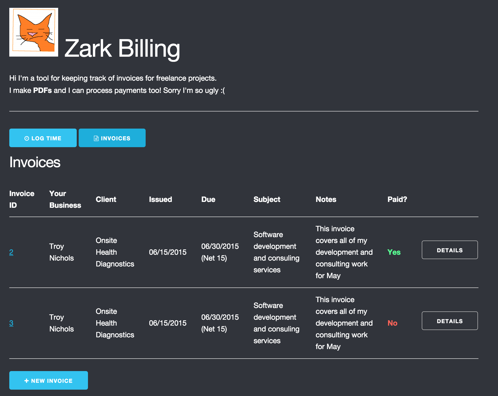

# Zark Billing

This is a billing and invoice tool written in EmberJS. It can create invoices, generate PDF documents from them, and process payments through the Stripe API.

## PDF Generation

PDF generation is done client side, in Javasript, using the excellent pdfkit library.

## Backend

The app connects to a backend REST API built with rails. See: [https://github.com/troygnichols/zark-billing-api](https://github.com/troygnichols/zark-billing-api)

## Heroku

This is app is deployed to heroku:

[https://zark-billing.herokuapp.com](https://zark-billing.herokuapp.com)
